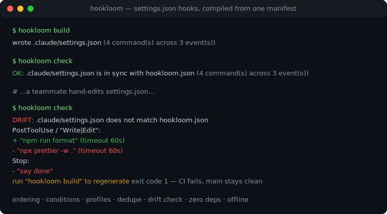
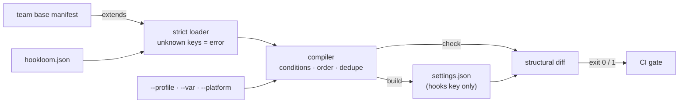

# hookloom

[English](README.md) | [中文](README.zh.md) | [日本語](README.ja.md)

[](LICENSE)   [](CONTRIBUTING.md)

**オープンソースの agent hook コンパイラ——宣言的な manifest 一枚から settings.json を生成。決定的な順序付け、コンパイル時条件、重複排除、そして手編集がチームの設定を壊す前に捕まえる CI ドリフトチェック付き。**



```bash
# not yet on npm — install from a checkout of this repository
npm install && npm run build && npm pack
npm install -g ./hookloom-0.1.0.tgz
```

## なぜ hookloom？

agent 設定を git で共有するチームは、いつも同じ壊し方をする：全員が `.claude/settings.json` の `hooks` ブロックを手で編集し、四重にネストした配列のどれが本質なのか誰にも分からない。マージがフォーマッタ hook を静かに複製して二重に発火し、誰かが足した macOS 専用 hook がすべての Linux ランナーを壊す。このファイルは本来*コンパイル成果物*なのに、手で保守されている。hookloom は、インフラ設定が何年も前に手に入れたものを hooks にもたらす：宣言的な信頼できる唯一の情報源だ。各 hook は一度だけ宣言する——id と優先度、そして「`tsconfig.json` が存在するときだけ」「`--profile ci` のときだけ」といった任意の条件付きで——`hookloom build` が `hooks` キーを決定的にコンパイルし、settings.json の他のバイトには一切触れない。`hookloom check` はメモリ上で再コンパイルし、コミットされたファイルが食い違えば読みやすい diff とともに終了コード 1 を返す。これ一行が CI 対応のすべてだ。もう一つの JSON エディタでも dotfiles マネージャでもない：ファイルの中身ではなく、hook の*意味論*——実行順序、matcher グループ、重複コマンド——を理解する。

|  | hookloom | settings.json の手編集 | dotfiles マネージャ（chezmoi、stow） | jq / マージスクリプト |
|---|---|---|---|---|
| 信頼できる情報源 | 宣言的 manifest 一枚 | 出力ファイルそのもの | ファイルのテンプレート複製 | 散在するスクリプトロジック |
| 順序付け | 明示的な優先度、決定的 | 配列がたまたま並んでいる順 | ファイル単位のみ | 挿入順で壊れやすい |
| 条件 | hook 単位：platform、環境変数、ファイル、profile | マシンごとにコピペ | マシンごとのテンプレート | 手書きの if |
| 重複 hook | 畳んで報告 | 静かに二重発火 | 検出しない | 検出しない |
| ドリフト検出 | `check` が diff 付きで終了コード 1 | なし | `chezmoi diff`（ファイル全体） | なし |
| 他の設定キー | バイト単位で保持 | 該当なし | ファイル全体を占有 | スクリプト次第 |
| チーム共有 | `extends` チェーン + id 単位の上書き | マージ衝突 | テンプレートを fork | スクリプトを fork |

<sub>比較は 2026-07 時点の各ツールの文書化された挙動に基づく。dotfiles マネージャは本業——ファイル全体のマシン間同期——には優れており、hooks 配列の中身のモデルを持たないだけである。</sub>

## 特徴

- **宣言的 manifest、コンパイルされる出力** —— 各 hook は安定した id で一度だけ宣言。`build` は `hooks` キーを生成し、permissions・env・model などの他の設定キーにはバイト単位で触れない。
- **CI のためのドリフトチェック** —— `hookloom check` はメモリ上で再コンパイルし、コミット済みファイルと構造比較：同期なら終了 0、ドリフトなら終了 1 で、`+`/`-`/`~` 行が食い違ったコマンド・matcher・イベントを名指しする。
- **決定的な順序付け** —— イベントはライフサイクル順に出力、hook は明示的優先度で整列し manifest 上の位置が安定タイブレーク。同じ入力なら二台のマシンでバイト同一のファイルになる。
- **コンパイル時条件** —— `when` 句が platform、環境変数、ファイル存在、profile（`--profile ci`）、否定で hook をゲートする——評価はビルド時で、除外されたものは `explain` が失敗した事実そのものを表示する。
- **`extends` によるチーム基盤** —— プロジェクトは共有 manifest を継承し、単一 hook を id で上書き（調整、優先度変更、`"enabled": false`）でき、他の順序は乱れない。
- **重複排除と lint** —— コンパイル後に同一のコマンドは一つに畳まれ、除外は報告される。`lint` はイベント名の typo、正規表現として不正な matcher、未定義の `${VAR}` 参照、未使用の vars を出荷前に捕まえる。
- **ランタイム依存ゼロ、完全オフライン** —— 必要なのは Node.js だけ。ネットワークなし、テレメトリなし、devDependency は `typescript` のみ。

## クイックスタート

リポジトリのルートに `hookloom.json` を書く：

```json
{
  "version": 1,
  "target": ".claude/settings.json",
  "vars": { "FORMAT": "npx prettier --write" },
  "hooks": [
    { "id": "guard-secrets", "event": "PreToolUse", "matcher": "Read|Grep",
      "run": "sh scripts/hooks/deny-secret-reads.sh", "timeout": 5, "priority": 10 },
    { "id": "format-on-edit", "event": "PostToolUse", "matcher": "Write|Edit",
      "run": "${FORMAT} \"$CLAUDE_FILE_PATHS\"", "timeout": 60 },
    { "id": "ci-transcript", "event": "Stop",
      "run": "sh scripts/hooks/export-transcript.sh", "when": { "profile": ["ci"] } }
  ]
}
```

ビルドし、CI で検証する（`/work/app` で実際に取得した実行結果）：

```bash
hookloom build
hookloom check
```

```text
wrote /work/app/.claude/settings.json (2 command(s) across 2 event(s))
OK: /work/app/.claude/settings.json is in sync with /work/app/hookloom.json (2 command(s) across 2 event(s))
```

その後チームメイトが生成ファイルを手編集すると、次の `hookloom check` がビルドを落とす（実際に取得した実行結果、終了コード 1）：

```text
DRIFT: /work/app/.claude/settings.json does not match /work/app/hookloom.json
  PostToolUse / "Write|Edit":
    + "npx prettier --write "$CLAUDE_FILE_PATHS"" (timeout 60s)
    - "npx prettier -w ." (timeout 60s)
  Stop:
    - "say done"
run "hookloom build" to regenerate
```

*起きなかった*ことに注目してほしい：`ci-transcript` hook は一度も diff に現れない。`when.profile` でゲートされ、どちらの実行も `--profile ci` を選んでいないからだ。すでに手書きの hooks があるリポジトリもやり直しにはならない——`hookloom adopt` が既存の settings.json を manifest に逆コンパイルし、最初の `check` から緑になる。チーム基盤 + プロジェクトの完全な例（`extends` 付き）は [examples/](examples/README.md) にある。

## manifest

JSON ファイル一枚：`version`、任意の `extends` と `vars`、`target`（既定 `.claude/settings.json`）、そして `hooks` 配列。完全なリファレンスは [docs/manifest-format.md](docs/manifest-format.md)。

| キー | 既定値 | 効果 |
|---|---|---|
| `hooks[].id` | — | 一意で安定した名前。`extends` での上書き単位 |
| `hooks[].event` | — | `SessionStart`、`UserPromptSubmit`、`PreToolUse`、`PostToolUse`、`Notification`、`PreCompact`、`Stop`、`SubagentStop`、`SessionEnd` |
| `hooks[].matcher` | `""` | ツールイベント用のツール名正規表現。空なら出力から省く |
| `hooks[].run` | — | shell コマンド。`${NAME}` はコンパイル時に解決、裸の `$VAR` は shell に残す |
| `hooks[].priority` | `100` | 0–9999、小さいほどイベント内で先に実行 |
| `hooks[].timeout` | なし | 秒（1–3600）、そのまま出力 |
| `hooks[].when` | 常に真 | `platform`、`env`、`envEquals`、`fileExists`、`profile`、`not`——すべて AND |
| `extends` | `[]` | 親 manifest。親から順にマージし id 単位で上書き |

## hookloom CLI

| コマンド | すること | 終了コード |
|---|---|---|
| `build` | コンパイルしてターゲットへ書き込み（`--stdout` で表示のみ） | 0 / 2 入力エラー |
| `check` | メモリ上で再コンパイルし、ターゲットと diff | 0 同期 / 1 ドリフト / 2 |
| `explain` | 全 hook を列挙：採用（最終順序）、除外（失敗した事実）、重複排除 | 0 / 2 |
| `lint` | パースを超えた manifest 検査：イベント、正規表現、変数、重複 | 0 / 1 エラー / 2 |
| `adopt` | 既存の settings ファイルを manifest に逆コンパイル | 0 / 2 |

全コマンドが `--manifest <path>`（既定 `./hookloom.json`）を取り、コンパイルに影響するものは `--profile`、`--var NAME=value`、`--platform` も取るので、CI はどのマシンの出力でも再現できる。変数は manifest と `--var` からのみ解決され——環境は決して読まない——ビルドは再現可能に保たれる。

## アーキテクチャ



## ロードマップ

- [x] `extends` 付き厳格 manifest ローダ、コンパイラ（ライフサイクル順、優先度、条件、profile、`${VAR}`、重複排除）、構造的ドリフトチェック、`explain`、`lint`、`adopt`、5 コマンド CLI（v0.1.0）
- [ ] `hookloom fmt` —— manifest の正規化フォーマットとキー順序
- [ ] watch モード：ローカル開発中に manifest 変更で自動再ビルド
- [ ] ターゲット追加：一枚の manifest でプロジェクト設定とユーザー設定を両方管理
- [ ] lint 自動修正（`--fix`）：未使用 vars と重複宣言

完全な一覧は [open issues](https://github.com/JaydenCJ/hookloom/issues) を参照。

## コントリビュート

コントリビュート歓迎。`npm install && npm run build` でビルドし、`npm test`（91 テスト）と `bash scripts/smoke.sh`（`SMOKE OK` を出力すること）を実行する——このリポジトリは CI を持たず、上記の主張はすべてローカル実行で検証されている。[CONTRIBUTING.md](CONTRIBUTING.md) を読み、[good first issue](https://github.com/JaydenCJ/hookloom/issues?q=is%3Aissue+is%3Aopen+label%3A%22good+first+issue%22) を選ぶか、[discussion](https://github.com/JaydenCJ/hookloom/discussions) を始めてほしい。

## ライセンス

[MIT](LICENSE)
