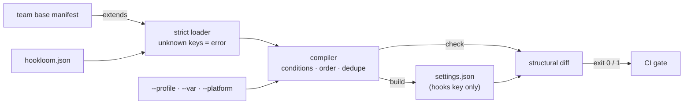

# hookloom

[English](README.md) | [中文](README.zh.md) | [日本語](README.ja.md)

[](LICENSE)   [](CONTRIBUTING.md)

**An open-source compiler for agent hooks — one declarative manifest becomes your settings.json, with deterministic ordering, compile-time conditions, dedupe, and a CI drift check that catches hand edits before they clobber the team.**


```bash
# not yet on npm — install from a checkout of this repository
npm install && npm run build && npm pack
npm install -g ./hookloom-0.1.0.tgz
```

## Why hookloom?

Teams that share agent configuration in git keep breaking it the same way: everyone hand-edits the `hooks` block of `.claude/settings.json`, nobody can tell which of the four nested arrays is load-bearing, a merge quietly duplicates a formatter hook so it fires twice, and the macOS-only hook someone added breaks every Linux runner. The file is a *compilation target* being maintained by hand. hookloom gives hooks what infrastructure config got years ago: a declarative source of truth. You declare each hook once — with an id, a priority, and optional conditions like "only when `tsconfig.json` exists" or "only under `--profile ci`" — and `hookloom build` compiles the `hooks` key deterministically, leaving every other byte of settings.json untouched. `hookloom check` recompiles in memory and exits 1 with a readable diff when the committed file disagrees, which is the entire CI story in one line. It is not another JSON editor or dotfiles manager: it understands hook *semantics* — execution order, matcher groups, duplicate commands — not just file contents.

|  | hookloom | hand-editing settings.json | dotfiles managers (chezmoi, stow) | jq / merge scripts |
|---|---|---|---|---|
| Source of truth | one declarative manifest | the output file itself | templated copies of the file | scattered script logic |
| Ordering | explicit priorities, deterministic | whatever the arrays happen to say | file-level only | insertion order, fragile |
| Conditions | per-hook: platform, env, files, profiles | copy-paste per machine | per-machine templates | hand-rolled ifs |
| Duplicate hooks | collapsed and reported | fire twice, silently | not detected | not detected |
| Drift detection | `check` exits 1 with a diff | none | `chezmoi diff` (whole file) | none |
| Other settings keys | preserved byte-for-byte | n/a | owns the whole file | depends on the script |
| Team sharing | `extends` chains with id-level override | merge conflicts | fork the template | fork the script |

<sub>Comparison against each tool's documented behavior as of 2026-07; dotfiles managers are excellent at their actual job — whole-file machine sync — and simply have no model of what is inside a hooks array.</sub>

## Features

- **Declarative manifest, compiled output** — each hook is declared once with a stable id; `build` generates the `hooks` key and never touches permissions, env, model or any other settings key, byte for byte.
- **Drift check built for CI** — `hookloom check` recompiles in memory and diffs structurally against the committed file: exit 0 in sync, exit 1 with `+`/`-`/`~` lines naming the exact command, matcher and event that diverged.
- **Deterministic ordering** — events emit in lifecycle order, hooks sort by explicit priority with manifest position as the stable tie-breaker; two machines compiling the same inputs produce byte-identical files.
- **Compile-time conditions** — `when` clauses gate hooks on platform, environment variables, file existence, profiles (`--profile ci`), and negation — evaluated at build time, with `explain` printing the exact failing fact for anything excluded.
- **Team bases via `extends`** — projects extend a shared manifest and override single hooks by id (retune, re-pin, or `"enabled": false`) without reshuffling everyone else's order.
- **Dedupe and lint** — identical compiled commands collapse to one entry with the drop reported; `lint` catches typo'd event names, matchers that are not valid regexes, undefined `${VAR}` references and unused vars before they ship.
- **Zero runtime dependencies, fully offline** — Node.js is the only requirement; no network, no telemetry, and `typescript` is the sole devDependency.

## Quickstart

Write `hookloom.json` at the repository root:

```json
{
  "version": 1,
  "target": ".claude/settings.json",
  "vars": { "FORMAT": "npx prettier --write" },
  "hooks": [
    { "id": "guard-secrets", "event": "PreToolUse", "matcher": "Read|Grep",
      "run": "sh scripts/hooks/deny-secret-reads.sh", "timeout": 5, "priority": 10 },
    { "id": "format-on-edit", "event": "PostToolUse", "matcher": "Write|Edit",
      "run": "${FORMAT} \"$CLAUDE_FILE_PATHS\"", "timeout": 60 },
    { "id": "ci-transcript", "event": "Stop",
      "run": "sh scripts/hooks/export-transcript.sh", "when": { "profile": ["ci"] } }
  ]
}
```

Build, and verify in CI (real captured runs from `/work/app`):

```bash
hookloom build
hookloom check
```

```text
wrote /work/app/.claude/settings.json (2 command(s) across 2 event(s))
OK: /work/app/.claude/settings.json is in sync with /work/app/hookloom.json (2 command(s) across 2 event(s))
```

Then a teammate hand-edits the generated file, and the next `hookloom check` fails the build (real captured run, exit code 1):

```text
DRIFT: /work/app/.claude/settings.json does not match /work/app/hookloom.json
  PostToolUse / "Write|Edit":
    + "npx prettier --write "$CLAUDE_FILE_PATHS"" (timeout 60s)
    - "npx prettier -w ." (timeout 60s)
  Stop:
    - "say done"
run "hookloom build" to regenerate
```

Note what did *not* happen: the `ci-transcript` hook never entered the diff, because it is gated on `when.profile` and neither run selected `--profile ci`. And a repository that already has hand-written hooks does not start over — `hookloom adopt` reverse-compiles the existing settings.json into a manifest whose very first `check` is green. A complete team-base + project example (with `extends`) lives in [examples/](examples/README.md).

## The manifest

One JSON file: `version`, optional `extends` and `vars`, a `target` (default `.claude/settings.json`), and a `hooks` array. Full reference in [docs/manifest-format.md](docs/manifest-format.md).

| Key | Default | Effect |
|---|---|---|
| `hooks[].id` | — | unique stable name; the unit of override in `extends` |
| `hooks[].event` | — | `SessionStart`, `UserPromptSubmit`, `PreToolUse`, `PostToolUse`, `Notification`, `PreCompact`, `Stop`, `SubagentStop`, `SessionEnd` |
| `hooks[].matcher` | `""` | tool-name regex for tool events; omitted from output when empty |
| `hooks[].run` | — | shell command; `${NAME}` resolved at compile time, bare `$VAR` left for the shell |
| `hooks[].priority` | `100` | 0–9999, lower runs earlier within the event |
| `hooks[].timeout` | none | seconds (1–3600), emitted verbatim |
| `hooks[].when` | always | `platform`, `env`, `envEquals`, `fileExists`, `profile`, `not` — all ANDed |
| `extends` | `[]` | parent manifests, merged parent-first with id-level override |

## The hookloom CLI

| Command | Does | Exit codes |
|---|---|---|
| `build` | compile and write the target (`--stdout` to print instead) | 0 / 2 bad input |
| `check` | recompile in memory, diff against the target | 0 in sync / 1 drift / 2 |
| `explain` | list every hook: included (final order), excluded (failing fact), deduped | 0 / 2 |
| `lint` | manifest checks beyond parsing: events, regexes, vars, duplicates | 0 / 1 errors / 2 |
| `adopt` | reverse-compile an existing settings file into a manifest | 0 / 2 |

All commands take `--manifest <path>` (default `./hookloom.json`); compile-affecting ones also take `--profile`, `--var NAME=value`, and `--platform` so CI can reproduce any machine's output. Variables resolve only from the manifest and `--var` — never the ambient environment — which keeps builds reproducible.

## Architecture



## Roadmap

- [x] Strict manifest loader with `extends`, compiler (lifecycle ordering, priorities, conditions, profiles, `${VAR}`, dedupe), structural drift check, `explain`, `lint`, `adopt`, and the five-command CLI (v0.1.0)
- [ ] `hookloom fmt` — canonical manifest formatting and key ordering
- [ ] Watch mode: rebuild on manifest change during local development
- [ ] Additional targets: project-local and user-level settings files in one manifest
- [ ] Lint autofixes (`--fix`) for unused vars and duplicate declarations

See the [open issues](https://github.com/JaydenCJ/hookloom/issues) for the full list.

## Contributing

Contributions are welcome. Build with `npm install && npm run build`, then run `npm test` (91 tests) and `bash scripts/smoke.sh` (must print `SMOKE OK`) — this repository ships no CI, every claim above is verified by local runs. See [CONTRIBUTING.md](CONTRIBUTING.md), grab a [good first issue](https://github.com/JaydenCJ/hookloom/issues?q=is%3Aissue+is%3Aopen+label%3A%22good+first+issue%22), or start a [discussion](https://github.com/JaydenCJ/hookloom/discussions).

## License

[MIT](LICENSE)
