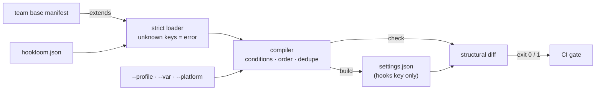

# hookloom

[English](README.md) | [中文](README.zh.md) | [日本語](README.ja.md)

[](LICENSE)   [](CONTRIBUTING.md)

**一个开源的 agent hook 编译器——用一份声明式 manifest 生成你的 settings.json：确定性排序、编译期条件、去重，外加一个能在手改内容毁掉团队配置之前拦下它的 CI 漂移检查。**


```bash
# not yet on npm — install from a checkout of this repository
npm install && npm run build && npm pack
npm install -g ./hookloom-0.1.0.tgz
```

## 为什么选 hookloom？

在 git 里共享 agent 配置的团队总以同一种方式把它弄坏：每个人都手改 `.claude/settings.json` 的 `hooks` 块，没人说得清四层嵌套数组里哪一层是关键；一次合并悄悄把格式化 hook 复制了一份、于是它触发两次；某人加的 macOS 专用 hook 弄坏了所有 Linux runner。这个文件本质上是一个*编译产物*，却在被手工维护。hookloom 把基础设施配置多年前就有的东西带给 hooks：一份声明式的事实来源。每个 hook 只声明一次——带 id、优先级，以及"仅当 `tsconfig.json` 存在"或"仅在 `--profile ci` 下"这类可选条件——`hookloom build` 就会确定性地编译出 `hooks` 键，settings.json 里其余每个字节都原样保留。`hookloom check` 在内存中重新编译，当提交的文件与之不符时以退出码 1 给出可读的 diff，一行命令就是完整的 CI 方案。它不是又一个 JSON 编辑器或 dotfiles 管理器：它理解的是 hook 的*语义*——执行顺序、matcher 分组、重复命令——而不只是文件内容。

|  | hookloom | 手改 settings.json | dotfiles 管理器（chezmoi、stow） | jq / 合并脚本 |
|---|---|---|---|---|
| 事实来源 | 一份声明式 manifest | 输出文件本身 | 文件的模板化副本 | 散落的脚本逻辑 |
| 排序 | 显式优先级，确定性 | 数组里碰巧是什么就是什么 | 仅文件级 | 插入顺序，脆弱 |
| 条件 | 按 hook：平台、环境变量、文件、profile | 每台机器复制粘贴 | 按机器的模板 | 手写 if |
| 重复 hook | 折叠并报告 | 静默触发两次 | 不检测 | 不检测 |
| 漂移检测 | `check` 以退出码 1 给出 diff | 没有 | `chezmoi diff`（整个文件） | 没有 |
| 其他设置键 | 逐字节保留 | 不适用 | 接管整个文件 | 取决于脚本 |
| 团队共享 | `extends` 链 + id 级覆盖 | 合并冲突 | fork 模板 | fork 脚本 |

<sub>对比基于各工具截至 2026-07 的文档行为；dotfiles 管理器在它们的本职——整文件的机器同步——上非常出色，只是对 hooks 数组内部是什么完全没有模型。</sub>

## 特性

- **声明式 manifest，编译式输出** —— 每个 hook 用稳定 id 只声明一次；`build` 生成 `hooks` 键，对 permissions、env、model 等其他设置键逐字节不碰。
- **为 CI 而生的漂移检查** —— `hookloom check` 在内存中重新编译并与提交的文件做结构化对比：同步则退出 0，漂移则退出 1，`+`/`-`/`~` 行精确指出偏离的命令、matcher 和事件。
- **确定性排序** —— 事件按生命周期顺序输出，hook 按显式优先级排序、以 manifest 位置为稳定决胜；两台机器编译相同输入得到逐字节一致的文件。
- **编译期条件** —— `when` 子句按平台、环境变量、文件存在性、profile（`--profile ci`）和取反来门控 hook——在构建时求值，`explain` 会为每个被排除的 hook 打印确切的失败事实。
- **用 `extends` 搭团队基线** —— 项目继承共享 manifest，并按 id 覆盖单个 hook（调参、重定优先级、或 `"enabled": false`），不打乱其他人的顺序。
- **去重与 lint** —— 编译后相同的命令折叠为一条并报告被丢弃者；`lint` 在上线前抓出写错的事件名、不是合法正则的 matcher、未定义的 `${VAR}` 引用和未使用的 vars。
- **零运行时依赖，完全离线** —— 只需要 Node.js；无网络、无遥测，`typescript` 是唯一的 devDependency。

## 快速上手

在仓库根目录写 `hookloom.json`：

```json
{
  "version": 1,
  "target": ".claude/settings.json",
  "vars": { "FORMAT": "npx prettier --write" },
  "hooks": [
    { "id": "guard-secrets", "event": "PreToolUse", "matcher": "Read|Grep",
      "run": "sh scripts/hooks/deny-secret-reads.sh", "timeout": 5, "priority": 10 },
    { "id": "format-on-edit", "event": "PostToolUse", "matcher": "Write|Edit",
      "run": "${FORMAT} \"$CLAUDE_FILE_PATHS\"", "timeout": 60 },
    { "id": "ci-transcript", "event": "Stop",
      "run": "sh scripts/hooks/export-transcript.sh", "when": { "profile": ["ci"] } }
  ]
}
```

构建，并在 CI 里校验（在 `/work/app` 实际捕获的运行）：

```bash
hookloom build
hookloom check
```

```text
wrote /work/app/.claude/settings.json (2 command(s) across 2 event(s))
OK: /work/app/.claude/settings.json is in sync with /work/app/hookloom.json (2 command(s) across 2 event(s))
```

随后某位同事手改了生成的文件，下一次 `hookloom check` 让构建失败（实际捕获的运行，退出码 1）：

```text
DRIFT: /work/app/.claude/settings.json does not match /work/app/hookloom.json
  PostToolUse / "Write|Edit":
    + "npx prettier --write "$CLAUDE_FILE_PATHS"" (timeout 60s)
    - "npx prettier -w ." (timeout 60s)
  Stop:
    - "say done"
run "hookloom build" to regenerate
```

注意*没有*发生什么：`ci-transcript` hook 从未进入 diff，因为它被 `when.profile` 门控，而两次运行都没有选 `--profile ci`。已经有手写 hooks 的仓库也不必从头开始——`hookloom adopt` 把现存的 settings.json 反向编译成一份 manifest，其第一次 `check` 就是绿的。完整的团队基线 + 项目示例（含 `extends`）见 [examples/](examples/README.md)。

## manifest

一个 JSON 文件：`version`、可选的 `extends` 与 `vars`、`target`（默认 `.claude/settings.json`），以及 `hooks` 数组。完整参考见 [docs/manifest-format.md](docs/manifest-format.md)。

| 键 | 默认值 | 作用 |
|---|---|---|
| `hooks[].id` | — | 唯一且稳定的名字；`extends` 中覆盖的单位 |
| `hooks[].event` | — | `SessionStart`、`UserPromptSubmit`、`PreToolUse`、`PostToolUse`、`Notification`、`PreCompact`、`Stop`、`SubagentStop`、`SessionEnd` |
| `hooks[].matcher` | `""` | 工具事件的工具名正则；为空时不输出该键 |
| `hooks[].run` | — | shell 命令；`${NAME}` 在编译期解析，裸 `$VAR` 留给 shell |
| `hooks[].priority` | `100` | 0–9999，越小在事件内越先执行 |
| `hooks[].timeout` | 无 | 秒（1–3600），原样输出 |
| `hooks[].when` | 恒真 | `platform`、`env`、`envEquals`、`fileExists`、`profile`、`not`——全部取 AND |
| `extends` | `[]` | 父 manifest，父先合并、id 级覆盖 |

## hookloom CLI

| 命令 | 做什么 | 退出码 |
|---|---|---|
| `build` | 编译并写入目标文件（`--stdout` 则打印） | 0 / 2 输入错误 |
| `check` | 内存中重编译，与目标文件做 diff | 0 同步 / 1 漂移 / 2 |
| `explain` | 列出每个 hook：纳入（最终顺序）、排除（失败事实）、去重 | 0 / 2 |
| `lint` | 解析之外的 manifest 检查：事件、正则、变量、重复 | 0 / 1 有错误 / 2 |
| `adopt` | 把现存 settings 文件反向编译为 manifest | 0 / 2 |

所有命令都接受 `--manifest <path>`（默认 `./hookloom.json`）；影响编译的命令还接受 `--profile`、`--var NAME=value` 和 `--platform`，让 CI 能复现任何机器的输出。变量只从 manifest 和 `--var` 解析——绝不读环境——构建因此可复现。

## 架构



## 路线图

- [x] 带 `extends` 的严格 manifest 加载器、编译器（生命周期排序、优先级、条件、profile、`${VAR}`、去重）、结构化漂移检查、`explain`、`lint`、`adopt`，以及五命令 CLI（v0.1.0）
- [ ] `hookloom fmt` —— manifest 的规范化格式与键排序
- [ ] watch 模式：本地开发时随 manifest 变更自动重建
- [ ] 更多目标：一份 manifest 同时管理项目级与用户级设置文件
- [ ] lint 自动修复（`--fix`）：未使用的 vars 与重复声明

完整列表见 [open issues](https://github.com/JaydenCJ/hookloom/issues)。

## 贡献

欢迎贡献。用 `npm install && npm run build` 构建，然后运行 `npm test`（91 个测试）和 `bash scripts/smoke.sh`（必须打印 `SMOKE OK`）——本仓库不带 CI，上面的每个断言都由本地运行验证。参见 [CONTRIBUTING.md](CONTRIBUTING.md)，认领一个 [good first issue](https://github.com/JaydenCJ/hookloom/issues?q=is%3Aissue+is%3Aopen+label%3A%22good+first+issue%22)，或发起一个 [discussion](https://github.com/JaydenCJ/hookloom/discussions)。

## 许可证

[MIT](LICENSE)
